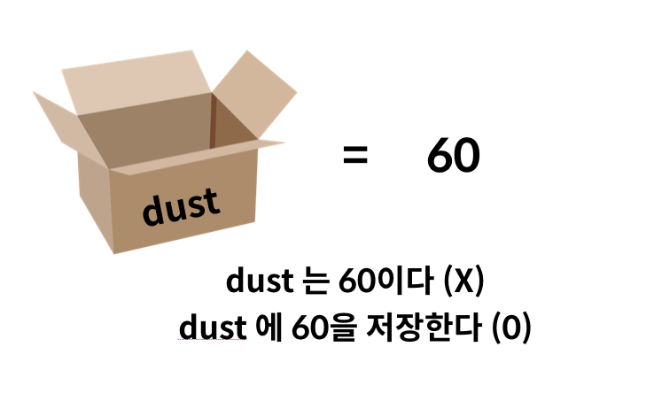

# Python 기초

## 개요

본 강의 자료는 [Python 공식 Tutorial](https://docs.python.org/3.7/tutorial/index.html)에 근거하여 만들어졌으며, Python 3.7버전에 해당하는 내용을 담고 있습니다.

또한, 파이썬에서 제공하는 스타일 가이드인 [`PEP-8`](https://www.python.org/dev/peps/pep-0008/) 내용을 반영하였습니다. 

파이썬을 활용하는 다양한 IT기업들은 대내외적으로 본인들의 스타일 가이드를 제공하고 있습니다. 

* [구글 스타일 가이드](https://github.com/google/styleguide/blob/gh-pages/pyguide.md)
* [Tensorflow 스타일 가이드](https://www.tensorflow.org/community/style_guide)

## 식별자

파이썬에서 식별자는 변수, 함수, 모듈, 클래스 등을 식별하는데 사용되는 이름이다. 

* 식별자의 이름은 영문알파벳, \_, 숫자로 구성된다.
* 첫 글자에 숫자가 올 수 없다. 
* 대소문자를 구별한다.
* 아래의 예약어는 사용할 수 없다. 

```
False, None, True, and, as, assert, break, class, continue, def, del, elif, else, except, finally, for, from, global, if, import, in, is, lambda, nonlocal, not, or, pass, raise, return, try, while, with, yield
```


```python
# 식별자들을 직접 확인해봅시다.
import keyword
keyword.kwlist
```


    ['False',
     'None',
     'True',
     'and',
     'as',
     'assert',
     'async',
     'await',
     'break',
     'class',
     'continue',
     'def',
     'del',
     'elif',
     'else',
     'except',
     'finally',
     'for',
     'from',
     'global',
     'if',
     'import',
     'in',
     'is',
     'lambda',
     'nonlocal',
     'not',
     'or',
     'pass',
     'raise',
     'return',
     'try',
     'while',
     'with',
     'yield']


*  내장함수나 모듈 등의 이름으로도 만들면 안된다.


```python
# 5를 string으로 바꿔봅시다.
str(5)
```


    ---------------------------------------------------------------------------

    TypeError                                 Traceback (most recent call last)

    <ipython-input-2-8046b3c08f3a> in <module>
          1 # 5를 string으로 바꿔봅시다.
    ----> 2 str(5)
    

    TypeError: 'str' object is not callable


```python
# 예시로 str에 값을 할당해보고, 오류를 확인해봅시다.
str = "hello"
str(5)

#str에 우리가 다른 값을 넣어버려서, 이제 str()기능을 할 수가 없다는 것
#내장함수에 이렇게 다른 값을 넣어버리면 안 된다!
```


    ---------------------------------------------------------------------------

    TypeError                                 Traceback (most recent call last)

    <ipython-input-5-59b72a93347d> in <module>
          1 # 예시로 str에 값을 할당해보고, 오류를 확인해봅시다.
          2 str = "hello"
    ----> 3 str(5)
          4 
          5 #str에 우리가 다른 값을 넣어버려서, 이제 str()기능을 할 수가 없다는 것
    

    TypeError: 'str' object is not callable


```python
# 뒤에 코드에 영향이 가니까 변수를 메모리에서 지워줍시다!!!!
# 주피터노트북 상단 메뉴의 Kernel > Restart and Clear Output 하거나
del str
```


```python
str(6)
```


    '6'


## 기초 문법

### 인코딩 선언

인코딩은 선언하지 않더라도 `UTF-8`로 기본 설정이 되어 있다.
(예전에는 UTF-8 따로 선언해줬어야 함)

만약, 인코딩을 설정하려면 코드 상단에 아래와 같이 선언한다. 
주석으로 보이지만, Python `parser`에 의해 읽혀진다.

```python
# -*- coding: <encoding-name> -*- 
```

### 주석(Comment)

* 주석은 `#`으로 표현한다. 
* `docstring`은 `"""`으로 표현한다. 
   
   : 여러 줄의 주석을 작성할 수 있으며, 보통 함수/클래스 선언 다음에 해당하는 설명을 위해 활용한다.
   
  
* 예시 : flask 공식 문서 일부 발췌


```python
# 주석을 연습해봅시다. 

```


```python
# docstring은 다음과 같이 확인할 수 있습니다.

def mysum(a, b):
    """ 이것은 덧셈 함수입니다.
    이 줄은 실행이 되지 않습니다.
    #을 안 쓰고 이렇게 쓰는 이유는 뭘까요?
    doctring을 쓰는 이유는 나중에 __doc__이라는 친구를 쓸 것이기 때문!
    """
    return a + b

mysum(2, 5)

#doctring을 넣어 놓으면 .__doc__ 찍었을 때 해당 함수에 있는 설명이 튀어나온다!
mysum.__doc__
```


    ' 이것은 덧셈 함수입니다.\n    이 줄은 실행이 되지 않습니다.\n    #을 안 쓰고 이렇게 쓰는 이유는 뭘까요?\n    doctring을 쓰는 이유는 나중에 __doc__이라는 친구를 쓸 것이기 때문!\n    '


### 코드 라인
* 기본적으로 파이썬에서는 `;` 을 작성하지 않는다.

* 한 줄로 표기할 떄는 `;`를 작성하여 표기할 수 있다. 


```python
# print문을 두번 써보자.
print('happy')
print('hacking')
```

    happy
    hacking
    


```python
# print문을 한줄로 이어서 써봅시다. 오류 메시지를 확인해주세요.
print('happy')print('hacking')
```


      File "<ipython-input-12-e731bd4c793c>", line 2
        print('happy')print('hacking')
                          ^
    SyntaxError: invalid syntax
    


```python
# ;을 통해 오류를 해결해봅시다.
print('happy');print('hacking')
```

    happy
    hacking
    

* 줄을 여러줄 작성할 때는 역슬래시`\`를 사용하여 아래와 같이 할 수 있다. 


```python
# print문을 통해 안되는 코드 예시 작성해봅시다.
print('
      파이썬은 쉽다.
      파이썬은 강력하다.
      파이썬은 빠르다.
      ')
```


      File "<ipython-input-14-2762c4a299c8>", line 2
        print('
               ^
    SyntaxError: EOL while scanning string literal
    


```python
# print문을 통해 되는 코드 예시 작성해봅시다.
print('\
      파이썬은 쉽다.\
      파이썬은 강력하다.\
      파이썬은 빠르다.\
      ')
```

          파이썬은 쉽다.      파이썬은 강력하다.      파이썬은 빠르다.      
    

* `[]` `{}` `()`는 `\` 없이도 가능하다.


```python
# list를 여러 줄에 걸쳐서 만들어봅시다.
menu = [
    "짬뽕",
    "햄버거",
    "닭도리탕",
    "부대찌개"    
]

matjip = {
    "백짬뽕" : "베이징코야",
    "햄버거" : "바스버거",
    "닭도리탕" : "고갯마루",
    "부대찌개" : "대우식당",
    "돼지고기" : "백운봉 막국수"
}
```

# 변수(variable) 및 자료형


<center></center>


<center></center>

* 변수는 `=`을 통해 할당(assignment) 된다. 

* 해당 자료형을 확인하기 위해서는 `type()`을 활용한다.
  - 자료형 단 세 가지(1.숫자, 2.문자, 3.불린)

* 해당 변수의 메모리 주소를 확인하기 위해서는 `id()`를 활용한다.


```python
# 변수에 값을 할당해 봅시다.
x = 'ssafy'
```


```python
# type()을 사용해 봅시다.
type(x)
```


    str


```python
# id()를 사용해 봅시다.
# 파이썬이 관리하는 공간 속에서 어디에 있는지 알려주는데
# 아래와 같이 알아보지 못 하는 긴 숫자가 나온다
# 이 숫자는 파이썬이 변수 x를 관리할 때 사용하는 고유번호다(like 주민번호)
id(x)
```


    11864384


* 같은 값을 동시에 할당할 수 있다.


```python
# 같은 값을 동시에 할당해봅시다.

y = z = 1004

#프로그래밍 언어는 오른쪽부터 읽으면 해석이 되는 경우가 많다
# 1004라는 숫자가 있고, 이걸 z에 할당하고, 이 z라는 값을 y에도 할당한다.
# 즉 y도 z도 모두 1004라는 값이 할당된다. 
# 같은 1004라도 python은 동일한 값으로 취급하는지 볼까? => 똑같은 id가 나온다! 같이 취급한다.

print(id(y))
print(id(z))
```

    96382848
    96382848
    

* 다른 값을 동시에 할당 가능하다.


```python
# 동시에 두개의 변수에 값 두개를 할당해봅시다.

name, age = "john", 34

print(name)
print(age)

#본질적으로 이것은 Tuple이다. 
(name, age) = ('john', 34)
print(name)
print(age)
```

    john
    34
    john
    34
    


```python
# 변수의 개수가 더 많을 때 오류를 알아봅시다.

x, y = 1
```


    ---------------------------------------------------------------------------

    TypeError                                 Traceback (most recent call last)

    <ipython-input-25-dd9efe7f767b> in <module>
          1 # 변수의 개수가 더 많을 때 오류를 알아봅시다.
          2 
    ----> 3 x, y = 1
    

    TypeError: cannot unpack non-iterable int object


```python
# 변수의 개수가 더 적을 때 오류를 알아봅시다.

a, b = 1, 2, 3
```


    ---------------------------------------------------------------------------

    ValueError                                Traceback (most recent call last)

    <ipython-input-26-d7540e1ff41a> in <module>
          1 # 변수의 개수가 더 적을 때 오류를 알아봅시다.
          2 
    ----> 3 a, b = 1, 2, 3
    

    ValueError: too many values to unpack (expected 2)


* 이를 활용하면 서로 값을 바꾸고 싶은 경우 아래와 같이 활용 가능하다.


```python
# 변수 x와 y의 값을 바꿔봅시다.

x, y = 5, 10

### 1번 방법
# z = 0
# z = x
# x = y
# y = z

### 2번 방법
x, y = y, x

print(x, y)
```

    5 10
    10 5
    

## 수치형(Numbers)

###  `int` (정수)

모든 정수는 `int`로 표현된다.

파이썬 3.x 버전에서는 `long` 타입은 없고 모두 `int` 형으로 표기 된다.

10진수가 아닌 8진수 : `0o`/2진수 : `0b` /16진수: `0x`로도 표현 가능하다. 


```python
# 변수에 정수를 넣고 해당 변수의 type을 알아봅시다.
a = 3
print(type(a))

#부동소수점 (cf.이더리움은 fixed 고정소수점 사용함)
a = 3.8
print(type(a))
```

    <class 'int'>
    <class 'float'>
    


```python
# python 3.x에서 long은 없어졌습니다.
# 보통 프로그래밍 언어 및 파이썬 2.x에서의 long은 OS 기준 32/64비트이다.
# 파이썬 3.x에서는 모두 int로 통합되었다.
```

### 오버플로우(overflow)
- 데이터 타입 별로 사용할 수 있는 메모리의 크기가 제한되어 있다. 
- 표현할 수 있는 수의 범위를 넘어가는 연산을 하게 되면, 기대했던 값이 출력되지 않는 현상, 즉 메모리가 차고 넘쳐 흐르는 현상

### arbitrary-precision arithmetic
- 파이썬에서 아주 큰 정수를 표현할 때 사용하는 메모리의 크기 변화
- 사용할 수 있는 메모리양이 정해져 있는 기존의 방식과 달리, 현재 남아있는 만큼의 가용 메모리를 모두 수 표현에 끌어다 쓸 수 있는 형태. (그래서 큰 숫자들 연산도 잘 돼서 통계 사용하는 데 좋음. 물론 안 되는 경우도 있긴 함)
- 특정 값을 나타내는데 4바이트가 부족하다면 5바이트, 더 부족하면 6바이트까지 사용 할 수 있게 유동적으로 운용.


```python
# 파이썬에서 가장 큰 숫자를 활용하기 위해 sys 모듈을 불러옵니다.
# 파이썬은 기존 C 계열 프로그래밍 언어와 다르게 정수 자료형에서 오버플로우가 없다.
# arbitrary-precision arithmetic를 사용하기 때문이다. 

import sys
max_int = sys.maxsize
print(max_int) 

# 최대치 정수 2147483647라고 나오지만 파이썬은 유동적으로 메모리를 관리하므로 (=arbitrary-precision arithmetic)
#이것보다 더 큰 자료도 사용할 수 있다.

big_num = max_int * max_int
print(big_num)

```

    2147483647
    4611686014132420609
    


```python
# n진수를 만들어보고, 출력 해봅시다.
# 거의 쓰지 않지만 가끔 2진수로 만드는 일도 있고, 역량시험에서 Ad+까지는 bit master 필요 없긴 함

# 0b 가 binary 숫자 들어간다는 표시다, 0o는 octal 8진수라는 표시
binary_num = 0b10
print(binary_num)

octal_num = 0o10
print(octal_num)

decimal_num = 10
print(decimal_num)

hexadecimal_number = 0x10
print(hexadecimal_number)
```

    2
    8
    10
    16
    

### `float`(부동소수점, 실수)

실수는 `float`로 표현된다. 

다만, 실수를 컴퓨터가 표현하는 과정에서 부동소수점을 사용하며, **항상 같은 값으로 일치되지 않는다.** (floating point rounding error)
(그래서: 블록체인에서는 floating num을 쓰지 않는다. 항상 같은 값으로 일치되지 않기 때문에)

이는 컴퓨터가 2진수(비트)를 통해 숫자를 표현하는 과정에서 생기는 오류이며, 대부분의 경우는 중요하지 않으나 값을 같은지 비교하는 과정에서 문제가 발생할 수 있다.


```python
# 변수에 실수를 넣고 해당 변수의 type을 알아봅시다.
a = 3.5
print(a)
```

    3.5
    


```python
# e를 사용할 수도 있습니다.
b = 314e-2
print(b)
print(type(b))
```

    3.14
    <class 'float'>
    

* 실수의 경우 실제로 값을 처리하기 위해서는 조심할 필요가 있다.


```python
# 실수의 덧셈을 해봅시다.
#계산기 덧셈과 크게 다르지 않음
# float와 int를 더하면 둘 다 float으로 해서 계산한다
3.5 + 3
```


    6.5


```python
# 실수의 뺄셈을 해봅시다.

3.5 - 3.15

# 0.3500000000000001가 나와버린다. 이게 위에서 말한 것처럼, 근사값을 보여주는 것이라 그러함
```


    0.3500000000000001


```python
# 우리가 원하는대로 반올림을 해봅시다.
# 자주 사용!

print(round(3.5-3.15))
print(round(3.5-3.15, 2))  #소수점 2째자리까지 round반올림하겠다!!
```

    0
    0.35
    


```python
# 두 개의 값이 같은지 확인해봅시다.

(3.5 - 3.15) == 0.35
#식은 () 괄호로 묶어줘야 더 정확하게 처리됨

#False로 나온다!! 
```


    False


* 따라서 다음과 같은 방법으로 처리 할 수 있다. 이외에 다양한 방법이 있음  
실수 연산


```python
# 기본적인 처리방법을 알아봅시다.
# 일단 변수로 각각 넣어보자
a = 3.5 -3.15
b = 0.35

#초근사값 비교하기 (별로 좋은 방법은 아님)
#뺀 값에 절대값을 씌워주고 
abs(a - b) <= 1e-10
```


    True


```python
# sys 모듈을 통해 처리하는 방법을 알아봅시다.
# (별로 좋은 방법은 아님)
import sys
abs(a - b) <= sys.float_info.epsilon  #내가 원하는 값만큼 충분히 가까워졌는지 판별하는 기능
```


    True


```python
# python 3.5부터 활용 가능한 math 모듈을 통해 처리하는 법을 알아봅시다.

import math
#math library 활용
math.isclose(a, b)
```


    True


### `complex` (복소수)

복소수는 허수부를 `j`로 표현한다. 


```python
# 변수에 복소수를 넣고 해당 변수의 type을 알아봅시다.
# 표현하는 것만 알고 넘어가면 될 듯
 
#코드에서 i는 매우 자주 많이 쓰이는 글자라서 `j`로 표현한다

a = 3 - 4j
type(a)

# 그냥 j만 쓰면 변수로 생각하므로 꼭 앞에 숫자를 써줘야 함. *곱 표시해도 변수로 인식하므로 그냥 써야 함
b = 3 - 1j
type(b)
```


    complex


```python
# 복소수와 관련된 메소드들을 확인해봅시다.
print(a.imag)  #허수부
print(a.real) #실수부
```

    -4.0
    3.0
    

## Bool

파이썬에는 `True`와 `False`로 이뤄진 `bool` 타입이 있다.

비교/논리 연산을 수행 등에서 활용된다.

다음은 `False`로 변환됩니다.
```
0, 0.0, (), [], {}, '', None
```


```python
# True와 False의 타입들을 알아봅시다.
print(type(True))
print(type(False))

```

    <class 'bool'>
    <class 'bool'>
    

* 형변환(Type Conversion)에서 추가적으로 다루는 내용입니다.


```python
# 다양한 True, False 상황들을 확인해봅시다.

# 숫자 0만 False로 인식한다. (보통 언어마다 **거짓**만 지정하고 나머지를 참으로 한다.)
print(bool(0), bool(1), bool(2))

#비어있는 것은 다 Falsy한 것들
print(bool(None), bool([]), bool({}), bool(''), bool(['hello']), bool('angela'))

```

    False True True
    False False False False True True
    

## None

파이썬에서는 값이 없음을 표현하기 위해 `None`타입이 존재합니다.
- 언제 가장 많이 보느냐?
- 함수에서 input은 입력, output은 반환(리턴)이라고 부를 것
- print 같은 


```python
# None의 타입을 알아봅시다.
print(print())

# 반환하지 않는 함수!! 
sorted_list = [5, 4, 3, 2, 1].sort()
print(sorted_list)

#원본 정렬 바로 바꿔주는 기능을 함 (반환X)
original_list = [9, 8, 7]
original_list.sort()
print(original_list)
```

    
    None
    None
    [7, 8, 9]
    


```python
# 변수에 저장해서 확인해봅시다.
a = None
print(a)
print(type(a))
```

    None
    <class 'NoneType'>
    

## 문자형(String)

### 기본 활용법

* 문자열은 Single quotes(`'`)나 Double quotes(`"`)을 활용하여 표현 가능하다. 

* 단, 문자열을 묶을 때 동일한 문장부호를 활용해야하며, `PEP-8`에서는 **하나의 문장부호를 선택**하여 유지하도록 하고 있습니다. 
(Pick a rule and Stick to it)


```python
# 변수에 문자열을 넣고 출력해봅시다.
pro_saying = '김지수 프로님은 얘기했다. "오늘은 종례가 없을 거예요."'
print(pro_saying)

name = "강동주"
print(name, pro_saying) # ,콤마가 있으면 space 띄우는 것과 같다.
print(name + " " + pro_saying) #이것과 본질적으로 같다
```

    김지수 프로님은 얘기했다. "오늘은 종례가 없을 거예요."
    강동주 김지수 프로님은 얘기했다. "오늘은 종례가 없을 거예요."
    강동주 김지수 프로님은 얘기했다. "오늘은 종례가 없을 거예요."
    


```python
# 사용자에게 받은 입력은 기본적으로 str입니다
#입력받기: 나이 입력받고 출력하기
age = input("당신의 나이를 입력해주세요:")
print(age)
```

    당신의 나이를 입력해주세요:20
    20
    

* 다만 문자열 안에 문장부호(`'`, `"`)가 활용될 경우 이스케이프 문자(`\`)를 사용하는 것 대신 활용 가능 합니다. 


```python
# 문자열 안에 문장부호를 활용해서 오류를 확인해봅시다.
print('철수가 말했다. '안녕'')
```


      File "<ipython-input-83-0273ade2c098>", line 2
        print('철수가 말했다. '안녕'')
                          ^
    SyntaxError: invalid syntax
    


```python
# 오류를 이스케이프 문자와 서로 다른 문장부호를 통해 해결해봅시다.
print('철수가 말했다. \'안녕\'')
```

    철수가 말했다. '안녕'
    

* 여러줄에 걸쳐있는 문장은 다음과 같이 표현 가능합니다.

`PEP-8`에 따르면 이 경우에는 반드시 `"""`를 사용하도록 되어 있습니다.


```python
# 여러줄을 출력해봅시다.
print('여러줄에\
출력하기')

print("""여러줄에
걸쳐서
출력하기""")
```

    여러줄에출력하기
    여러줄에
    걸쳐서
    출력하기
    


```python
# 물론 string interpolation도 가능합니다.
# 1. concatenation 합체
greeting = "안녕하세요. " + "저는 " + "angela입니다."
print(greeting)

# 2. interpolation (보간법) 수술(삽입)
name = 'angela'
greeting2 = f"안녕하세요. 저는 { name }입니다."  
#신규문법 f string
print(greeting2)
```

    안녕하세요. 저는 angela입니다.
    안녕하세요. 저는 angela입니다.
    

### 이스케이프 문자열

문자열을 활용하는 경우 특수문자 혹은 조작을 하기 위하여 사용되는 것으로 `\`를 활용하여 이를 구분한다. 

|<center>예약문자</center>|내용(의미)|
|:--------:|:--------:|
|\n|줄바꿈|
|\t|탭|
|\r|캐리지리턴|
|\0|널(Null)|
|`\\`|`\`|
|\'|단일인용부호(')|
|\"|이중인용부호(")|


```python
# 이스케이프 문자열을 조합하여 프린트해봅시다.
print('SSAFY는\n최고의')
print('SSAFY는\t최고의')
print('SSAFY는\r최고의') #엥?
#백슬래시를 문자로 쓰고 싶다면 \\쓰면 된다.
print('SSAFY는\\최고의')
```

    SSAFY는
    최고의
    SSAFY는	최고의
    최고의
    SSAFY는\최고의
    

* 이를 출력할 때 활용할 수가 있다.


```python
# print를 하는 과정에서도 이스케이프 문자열을 활용 가능합니다.
print('내용을 띄워서 출력하고 싶으면')
print('이렇게 하시면 돼요')
#프린트 함수는 기본적으로 다음 줄에 넘겨주는 것이 디폴트다.

#그래서 가장 많이 쓰는 것은
# end paramete
print('내용을 띄워서 출력하고 싶으면', end=' ')
print('이렇게 하시면 돼요')

print('내용을 띄워서 출력하고 싶으면', end='\t')
print('이렇게 하시면 돼요')

print('내용을 띄워서 출력하고 싶으면', end='\0')
print('이렇게 하시면 돼요')

```

    내용을 띄워서 출력하고 싶으면
    이렇게 하시면 돼요
    내용을 띄워서 출력하고 싶으면 이렇게 하시면 돼요
    내용을 띄워서 출력하고 싶으면	이렇게 하시면 돼요
    내용을 띄워서 출력하고 싶으면이렇게 하시면 돼요
    


```python
# 물론, end 옵션은 이스케이프 문자열이 아닌 다른 것도 가능합니다.
print('위와 같은 개행문자 말고도', end='! ')
print('다양한 문자를 넣을 수 있습니다', end='!!! ')
print('예를 들어 느낌표, 물음표 등등', end='?! ')

```

    위와 같은 개행문자 말고도! 다양한 문자를 넣을 수 있습니다!!! 예를 들어 느낌표, 물음표 등등?! 

### String interpolation 

1) `%-formatting` 

2) [`str.format()` ](https://pyformat.info/)

3) [`f-strings`](https://www.python.org/dev/peps/pep-0498/) : 파이썬 3.6 버전 이후에 지원 되는 사항입니다.

`.format()`는 해당 [링크](https://pyformat.info/)에서 확인바랍니다.


```python
# name 변수에 이름을 입력해봅시다.
name = '전인권'
age = 100
major = 'GOD'
address = '개포동'
```


```python
# %-formatting을 활용해봅시다.
# percent place order라고 하며 다른 언어에서도 자주 사용하는 방식임
'Hello, %s' % name

#어떤 내용이 어느 자리에 들어가는지 결과tring의 예측이 어렵다는 단점
'Hello, 나는 %s입니다. 나이는 %s입니다. 전공은 %s입니다. 주소는 %s입니다.' % (name, age, major, address)
```


    'Hello, 나는 전인권입니다. 나이는 100입니다. 전공은 GOD입니다. 주소는 개포동입니다.'


```python
# str.format()을 활용해봅시다.
'Hello, 나는 {}입니다. 나이는 {}입니다. 전공은 {}입니다. 주소는 {}입니다.'.format(name, age, major, address)

#위의 percent formatting과 string formatting은 본질적으로는 비슷하다.
```


    'Hello, 나는 전인권입니다. 나이는 100입니다. 전공은 GOD입니다. 주소는 개포동입니다.'


```python
# f-string을 활용해봅시다. 
# 압도적으로 직관적임
# 모던 언어들이 디폴트로 사용하는 것임
f'Hello, 나는 {name}입니다. 나이는 {age}입니다. 전공은 {major}입니다. 주소는 {address}입니다.'
```


    'Hello, 나는 전인권입니다. 나이는 100입니다. 전공은 GOD입니다. 주소는 개포동입니다.'


* f-strings에서는 형식을 지정할 수 있으며,


```python
# 다양한 형식을 활용하기 위해 datetime 모듈로 오늘을 표현해봅시다.
```


```python
import datetime
today = datetime.datetime.now()
print(today)

# string interpolation에서 연산과 숫자 출력형식을 지정해봅시다.
# 오늘은 xxxx년 xx월 xx일 xx시 나오게 하기
print(f'오늘은 {today.year}년 {today.month}월 {today.day}일 {today.hour}시')

# datetime은 formatting이 가능한 객체다. f-string에서는 형식을 지정할 수 있다는 게 이 말임
f'오늘은 {today:%y}년 {today:%m}월 {today:%d}일 {today:%H}시'

```

    2019-07-15 14:21:48.510011
    오늘은 2019년 7월 15일 14시
    


    '오늘은 19년 07월 15일 14시'


* 연산과 출력형식 지정도 가능합니다.


```python
# string interpolation에서 연산과 숫자 출력형식을 지정해봅시다.

pi = 3.141592
radius = 2
area = radius ** 2 * pi
print(area)

f'원주율이 {pi}일 때, 반지름이 {radius}인 원의 넓이는 {radius ** 2 * pi}다.'
```

    12.566368
    


    '원주율이 3.141592일 때, 반지름이 2인 원의 넓이는 12.566368다.'


# 연산자

## 산술 연산자
Python에서는 기본적인 사칙연산이 가능합니다. 

|연산자|내용|
|----|---|
|+|덧셈|
|-|뺄셈|
|\*|곱셈|
|/|나눗셈|
|//|몫|
|%|나머지(modulo)|
|\*\*|거듭제곱|


```python
# 2의 1000승을 확인해봅시다.
2 ** 1000
```


    10715086071862673209484250490600018105614048117055336074437503883703510511249361224931983788156958581275946729175531468251871452856923140435984577574698574803934567774824230985421074605062371141877954182153046474983581941267398767559165543946077062914571196477686542167660429831652624386837205668069376


```python
# 나눗셈과 관련된 산술연산자를 활용해봅시다.
print(5 / 2) #나누기
print(5 // 2) #몫
print(5 % 2) #modular 나머지
#나누기로 몫과 똑같은 결과 만드려면 int로 바꾸면 됨
print(int(5 / 2))
```

    2.5
    2
    1
    2
    


```python
# divmod는 나눗셈과 관련된 함수입니다.
#위의 나눗셈 operator 말고도 이런 것 가능

print(divmod(5, 2))

#(몫, 나머지) 튜플로 같이 빼주기 때문에 알고리즘 시험에서 쓰기 좋다
print(divmod(5, 2)[0])

#이렇게 변수에 각각 넣어줄 수 있음
quotient, remainder = divmod(5, 2)
print(quotient, remainder)
print(f'몫은 {quotient} 나머지는 {remainder}')
```

    (2, 1)
    2
    2 1
    몫은 2 나머지는 1
    

* 양수/음수도 표현 가능합니다.


```python
# 음수 양수 표현도 해봅시다.
pos = 4
print(-pos)

neg = -5
print(-neg)

# -로 하는 negate operator가 코드 짧게 해주는 경우가 많다!!
```

    -4
    5
    

## 비교 연산자

우리가 수학에서 배운 연산자와 동일하게 값을 비교할 수 있습니다.

|연산자|내용|
|----|---|
|a > b|초과|
|a < b|미만|
|a >= b|이상|
|a <= b|이하|
|a == b|같음|
|a != b|같지않음|


```python
# 숫자의 대소관계를 비교해봅시다.
3 > 6
```


    False


```python
# 같은 숫자인지 확인해봅시다.
print(3 == 6)
print(3 != 4)   #같지 않음
```

    False
    True
    


```python
# 다른 숫자인지 확인해봅시다.
3.0 == 3
#확연하게 알 수 있는 float은 int와도 == 등호 operator가 통한다. 
```


    True


```python
# 문자열도 같은지 확인해봅시다.
'HI' == 'hi'

#대문자와 소문자는 완전 다르다
```


    False


## 논리 연산자

|연산자|내용|
|---|---|
|a and b|a와 b 모두 True시만 True|
|a or b|a 와 b 모두 False시만 False|
|not a|True -> False, False -> True|

우리가 보통 알고 있는 `&` `|`은 파이썬에서 비트 연산자이다.


```python
# and과 관련해서 모든 case를 출력해봅시다.
print(True and True)   #둘다 True일 때만 True로 인정하는 것이 and operator
print(True and False)
print(False and True)
print(False and False)
```

    True
    False
    False
    False
    


```python
# or과 관련해서 모든 case를 출력해봅시다.
print(True or True)   
print(True or False)
print(False or True)
print(False or False)  #이것만 False다.

#이런 진리표 익혀두기
```

    True
    True
    True
    False
    


```python
# not을 활용해봅시다.
# negate operator

print(not True)
print(not 0)
```

    False
    True
    

* 파이썬에서 and는 a가 거짓이면 a를 리턴하고, 참이면 b를 리턴한다.
* 파이썬에서 or은 a가 참이면 a를 리턴하고, 거짓이면 b를 리턴한다.


```python
# and의 단축평가(short-circuit evaluation)에 대해서 알아봅시다.

#이거 나중에 쓸 일 있다

print(3 and 5) 
#하면 결과로~~ 5가 나온다!

print(3 and 0)
#하면 결과로 0이 나온다

print(0 and 3)

print(0 and 0)

#파이썬에서 and는 a가 거짓이면 a를 리턴하고, 참이면 b를 리턴한다.
#거짓이면 거짓인 것 중 앞의 것을 리턴하고, 참이면 뒤의 것을 리턴한다.
print(True and 2)

#나중에 빈 배열이면 뭐를 출력하고 이런 것들도 사용할 것이다.
```

    5
    0
    0
    0
    2
    


```python
# or의 단축평가(short-circuit evaluation)에 대해서 알아봅시다.

# 우리는 and보다는 or를 많이 사용한다. 이게 아니면 다른 걸 해라 라는 느낌임

print(3 or 5)
print(3 or 0)
print(0 or 3)
print(0 or 0)

#or의 진리표를 보면, 하나만 맞아도 되니까
#앞의 것이 진실이면 바로 앞의 것을 리턴해버림

```

    3
    3
    3
    0
    

## 복합 연산자

복합 연산자는 연산과 대입이 함께 이뤄진다. 

가장 많이 활용되는 경우는 반복문을 통해서 개수를 카운트하거나 할 때 활용된다.

|연산자|내용|
|----|---|
|a += b|a = a + b|
|a -= b|a = a - b|
|a \*= b|a = a \* b|
|a /= b|a = a / b|
|a //= b|a = a // b|
|a %= b|a = a % b|
|a \*\*= b|a = a ** b|


```python
# 복합연산자는 이럴 때 사용됩니다.
cnt = 0
while cnt < 5:
    print(cnt)    #여기서 멈추면 무한 루프 되어 버림
    cnt += 1    #이렇게 늘어나서 종료조건에 가야 함
```

    0
    1
    2
    3
    4
    

## 기타 연산자

### Concatenation

숫자가 아닌 자료형은 `+` 연산자를 통해 합칠 수 있다.

### Containment Test

`in` 연산자를 통해 속해있는지 여부를 확인할 수 있다.

### Identity

`is` 연산자를 통해 동일한 object인지 확인할 수 있다.  
주로 등호 `==` 보다는 is를 많이 사용하게 될 것이다.  
  
(나중에 Class를 배우고 다시 학습)

### Indexing/Slicing
`[]`를 통한 값 접근 및 `[:]`을 통한 슬라이싱 

(다음 챕터를 배우면서 추가 학습)


```python
# 문자열끼리 더해봅시다.(합쳐봅시다.)
'soft' + 'ware'
```


    'software'


```python
# list끼리 더해봅시다.(합쳐봅시다.)
[1, 2, 3] + [4, 5, 6]

#딕셔너리도 더해지나?
# {'name':'john', 'age':20} + {'major':'jijon'} #안 더해진다.

#튜플은 더해지나?
(1, 2, 3) + (4, 5, 6)
```


    (1, 2, 3, 4, 5, 6)


```python
# 문자열안에 특정한 문자가 있는지 확인해봅시다.
'S' in 'Ssafy'
```


    True


```python
# list안에 특정한 원소가 있는지 확인해봅시다.
3 in [1, 2, 3]
```


    True


```python
# range안에 특정한 원소가 있는지 확인해봅시다.
46 in range(1, 46)
```


    False


```python
# is는 맛만 봅시다.
# 파이썬에서 -5부터 256까지의 id는 동일합니다.

# -5라고 하는 건 어디서 써도 한 프로그래밍 context 안에서는 똑같은 id가 나온다는 것
# 왜냐면 이 정수 범위의 기본 정수들은 굉장히 자주 사용하고 속도가 중요하므로
# 메모리를 미리 할당해놓고 계속해서 똑같은 id를 사용할 것이다.
# 그렇지만 257부터는 다른 곳에서는 생성될 때마다 또 다른 값이 부여될 것이다.

print(id(-5), id(256))
print(id(-5) is id(255))
print(id(257))
print(id('hi') is id('hi'))  #str도 입력할 때마다 서로 다른 값을 부여한다. 우리 눈에는 같아 보이지만

print(id(0))
print(id(0) is id(0))
#id 두 개의 특정 값에 대해서 is operator에 의해 생성되는 id 숫자가 달라서 false다.
print(0 is 0)

#257부터는 id가 서로 달라짐
a = 257
b = 257
print(a is b)

#256까지는 id가 서로 같음
c = 256
d = 256
print(c is d)
```

    1848730624 1848734800
    False
    113928560
    False
    1848730704
    False
    True
    False
    True
    


```python
# id는 다르죠!
```


```python
# 문자열을 인덱싱을 통해 값에 접근해봅시다.
```

## 연산자 우선순위

0. `()`을 통한 grouping

1. Slicing

2. Indexing

3. 제곱연산자
    \*\*

4. 단항연산자 
    +, - (음수/양수 부호)

5. 산술연산자
    \*, /, %
    
6. 산술연산자
    +, -
 
7. 비교연산자, `in`, `is`

8. `not`

9. `and` 

10. `or`


```python
# 우선순위를 확인해봅시다.
# PEMDAS 순위라고 합니다. (Parenthesis, Exponents, Multiplication and ...)
# 모든 것을 override하는 것은 최우선은 ()괄호니까 괄호를 열심히 쓰자!

print(-3 ** 4) #우선순위는 단항연산자인 +-부호보다 제곱연산이기 때문임
print(-(3 ** 4))  #그냥 괄호 써서 쓰면 이런 거 안 외워도 됩니다.
print((-3) ** 4)
```

    -81
    -81
    81
    

# 기초 형변환(Type conversion, Typecasting)


파이썬에서 데이터타입은 서로 변환할 수 있다.

## 암시적 형변환(Implicit Type Conversion)
사용자가 의도하지 않았지만, 파이썬 내부적으로 자동으로 형변환 하는 경우이다.
아래의 상황에서만 가능하다.
* bool
* Numbers (int, float, complex)


```python
# boolean과 integer는 더할 수 있을까요?

print(True + 3)
#결과로 4가 나온다.
#True=1로 암시적 형변환을 해서 그렇다.

print(False + 3)
#False=0으로 암시적 형변환

#이걸 아주 잘 해주는 게 Java Script라서 별 별 것들을 다 조합 가능하다.
```

    4
    3
    


```python
# int, float, complex를 각각 변수에 대입해봅시다.
int_num = 3
float_num = 5.0
complex_num = 3 + 5j
```


```python
# int와 float를 더해봅시다. 그 결과의 type은 무엇일까요?
int_num + float_num
#int를 float로 암시적 변환해준다.
```


    8.0


```python
# int와 complex를 더해봅시다. 그 결과의 type은 무엇일까요?
int_num + complex_num

#좀 더 빡세게 계산해야 하는 형태로 Python이 자동변환해주는 것이다.
```


    (6+5j)


## 명시적 형변환(Explicit Type Conversion)

위의 상황을 제외하고는 모두 명시적으로 형 변환을 해주어야한다.

* string -> intger  : 형식에 맞는 숫자만 가능
* integer -> string : 모두 가능

암시적 형변환이 되는 모든 경우도 명시적으로 형변환이 가능하다.

* `int()` : string, float를 int로 변환
* `float()` : string, int를 float로 변환
* `str()` : int, float, list, tuple, dictionary를 문자열로 변환

`list(), tuple()` 등은 다음 챕터에서 배울 예정이다.


```python
# integer와 string 사이의 관계는 명시적으로 형변환을 해줘야만 합니다.
#3 + '등'  
#TypeError가 나온다

str(3) + '등'
```


    '3등'


```python
# string 3을 integer로 변환해봅시다.
a = '3'
int(a) + 5
```


    8


```python
# string 3.5를 float로 변환해봅시다.
b = '3.5'
float(b) + 5.0
```


    8.5


```python
# string은 글씨가 숫자일때만 형변환이 가능합니다.
c = 'hi'
int(c)
#ValueError 나온다. 10진수가 아닌 것이 들어 있다고 말해준다.
```


    ---------------------------------------------------------------------------

    ValueError                                Traceback (most recent call last)

    <ipython-input-225-2f58be996ffa> in <module>
          1 # string은 글씨가 숫자일때만 형변환이 가능합니다.
          2 c = 'hi'
    ----> 3 int(c)
    

    ValueError: invalid literal for int() with base 10: 'hi'


```python
# string 3.5를 int로 변환할 수는 없습니다.
d = '3.5'

# 소수점str을 바로 int로 할 수 없음 ValueError
int(d)
```


    ---------------------------------------------------------------------------

    ValueError                                Traceback (most recent call last)

    <ipython-input-227-f56c5aa3a7e5> in <module>
          1 # string 3.5를 int로 변환할 수는 없습니다.
          2 d = '3.5'
    ----> 3 int(d)
    

    ValueError: invalid literal for int() with base 10: '3.5'


```python
# float 3.5는 int로 변환이 가능합니다.
d = '3.5'

#float로 한번 싸서 숫자로 인식하게 해줘야 > int로 변환이 가능하다.
int(float(d))
```


    3


```python
# hex를 convert하는 법 : int를 쓰는데 16진수라고 알려주면 된다
#ord를 하고 나면 아스키 코드가 나온다. 
int('ab', 16)
int('0x'+'ab', 16)
```


    171


# 시퀀스(sequence) 자료형

`시퀀스`는 데이터의 순서대로 나열된 형식을 나타낸다. 

**주의! 순서대로 나열된 것이 정렬되었다라는 뜻은 아니다.**

파이썬에서 기본적인 시퀀스 타입은 다음과 같다.

1. 리스트(list)

2. 튜플(tuple)

3. 레인지(range)

4. 문자열(string)

5. 바이너리(binary) : 따로 다루지는 않습니다.


## `list`

<center></center>

**활용법**
```python
[value1, value2, value3]
```

리스트는 대괄호`[]` 를 통해 만들 수 있습니다.

값에 대한 접근은 `list[i]`를 통해 합니다.


```python
# 빈 리스트를 만들어봅시다.
l = []        #빈리스트 만들기 방법1
ll = list()   #빈리스트 만들기 방법2
print(l)
print(ll)
```

    []
    []
    


```python
# 원소를 포함한 리스트를 만들어봅시다.
location = ['강남', '역삼']
print(location)
print(type(location))
```

    ['강남', '역삼']
    <class 'list'>
    


```python
# 첫번째 값에 접근해봅시다.
location[0]
```


    '강남'


## `tuple`

**활용법**
```python
(value1, value2)
```

튜플은 리스트와 유사하지만, `()`로 묶어서 표현합니다.

그리고 tuple은 **수정 불가능(immutable)**하고, 읽을 수 밖에 없습니다. (너모너모 중요해!)

직접 사용하는 것보다는 파이썬 내부에서 사용하고 있습니다.


```python
# tuple을 만들어봅시다.
tp = (1, 2, 3, 4, 5)
print(tp)
print(type(tp))
```

    (1, 2, 3, 4, 5)
    <class 'tuple'>
    


```python
# 아래와 같이 만들 수 있습니다.

# tuple은 컴퓨터공학에서 어디에 쓰이나요?? = 데이터베이스에서 쓰인다!
# 튜플은 데이터베이스에서 자료 하나라고 생각하면 된다.

x = 5
y = 3
#x, y = y, x 괄호 없이 쓰던 것처럼
(x, y) = (y, x)   #이렇게 파이썬 내부적으로는 튜플 형태로 데이터를 처리한다.

tp2 = 1, 2, 3, 4, 5  #이렇게 괄호 없이 써도 위의 tp와 완전 동일한 튜플 데이터 생긴다
print(tp2)
```

    (1, 2, 3, 4, 5)
    


```python
# 파이썬 내부에서는 다음과 같이 활용됩니다.
# 앞선 2. 변수 및 자료형 예제에서 사용된 코드입니다.
```


```python
# 실제로는 tuple로 처리됩니다.
```


```python
# 변수의 값을 swap하는 코드 역시 tuple을 활용하고 있습니다. 
x, y = 1, 2
x, y = y, x
print(x, y)
```

    2 1
    

##  `range()`

레인지는 숫자의 시퀀스를 나타내기 위해 사용됩니다.

기본형 : `range(n)` 


> 0부터 n-1까지 값을 가짐


범위 지정 : `range(n, m)` 

> n부터 m-1까지 값을 가짐

범위 및 스텝 지정 : `range(n, m, s)`

> n부터 m-1까지 +s만큼 증가한다


```python
# range를 만들어봅시다.
type(range(1, 46))
#range라는 자료형이다. (1, 2, 3 .... 46)과는 자료형이 다르다. 

#하지만 활용되는 건 비슷함

r = range(1, 10)
l = [1, 2, 3, 4, 5, 6, 7, 8, 9]
for x in r:
    print(x)
    
for y in l:
    print(y)
```

    1
    2
    3
    4
    5
    6
    7
    8
    9
    1
    2
    3
    4
    5
    6
    7
    8
    9
    


```python
# range에 담긴 값을 list로 바꿔서 확인해봅시다.
r = range(1, 10)
l = [1, 2, 3, 4, 5, 6, 7, 8, 9]

#range는 list로 형변환이 가능함
print( list(r) == l )
print( r == l )
```

    True
    False
    


```python
# 4 ~ 8까지의 숫자를 담은 range를 만들어봅시다.
range(4, 9)
list(range(4, 9))
```


    [4, 5, 6, 7, 8]


```python
# 0부터 -9까지 담긴 range를 만들어봅시다.

# 1번방법 : 수직선상으로 음수부터 시작하면 된다
print(list(range(-9, 1)))

# 2번방법 : 스텝지정
# 0부터 -10 이전까지 뒤로 한 칸씩 이동한다
print(list(range(0, -10, -1)))
```

    [-9, -8, -7, -6, -5, -4, -3, -2, -1, 0]
    [0, -1, -2, -3, -4, -5, -6, -7, -8, -9]
    


## 시퀀스에서 활용할 수 있는 연산자/함수 

- 이건 당장 암기할 건 아니지만, 많이 쓰다 보면 익숙해질 것
- 나중에 알고리즘 시험 볼 때 능숙하게 쓰면 편하다!

|operation|설명|
|---------|---|
|x in s	|containment test|
|x not in s|containment test|
|s1 + s2|concatenation|
|s * n|n번만큼 반복하여 더하기
|s[i]|indexing|
|s[i:j]|slicing|
|s[i:j:k]|k간격으로 slicing|
|len(s)|길이|
|min(s)|최솟값|
|max(s)|최댓값|
|s.count(x)|x의 개수|


```python
# contain test를 확인해봅시다.
l = [1, 2, 3, 4, 5, 6, 7, 8, 9]

print( 3 not in l )
print( 1 in l )
```

    False
    True
    


```python
# concatenation를 해봅시다.
li = [10, 11]
print( l + li )

#range끼리 더하는 건 안됨

#list와 tuple은 거~의 유사한 느낌이긴 하다
print( (1, 2, 3) + (4, 5, 6) )

#tuple은 이미 존재하는 데이터를 읽을 수는 있음
print(tp[0])
#하지만 새로 만드는 건 불가능하다!!!!
#tp[2] = 4
```

    [1, 2, 3, 4, 5, 6, 7, 8, 9, 10, 11]
    (1, 2, 3, 4, 5, 6)
    1
    


```python
# 숫자 0이 6개 있는 list를 만들어봅시다.
l = [0,0,0,0,0,0]   #이건 무식한 방법이고
l=[0]*6    #이 방법을 생각보다 많이 쓸 것이다.
print(l)
```

    [0, 0, 0, 0, 0, 0]
    


```python
# indexing과 slicing을 하기 위해 list하나를 만들어주세요.
location = ['사당', '강남', '역삼', '서초', '삼성']
```


```python
# 두번쨰, 세번쨰 값만 가져와봅시다.
location[2:4]
#뒤의 숫자는 미만이다.
```


    ['역삼', '서초']


```python
# slicing으로 리스트 스텝 돌기
print( location[1:6:2] )   #step 파라미터로 설정하면 된다!!

# slicing으로 리스트 뒤집어버리기 (역스텝 밟기)
print( location[::-1] )

#반대로 한스텝씩 처음부터 끝까지 가기 = string 다룰 때도 자주 하게 될 것이다!!
ssafy = 'ssafy'
print( ssafy[::-1] )

#앞뒤가 똑같은 단어인지 확인하기 (알고리즘 문제에서 많이 나옴) 
pal = 'racecar'
pal == pal[::-1]
```

    ['강남', '서초']
    ['삼성', '서초', '역삼', '강남', '사당']
    yfass
    


    True


```python
# 0부터 30까지의 숫자를 3씩 증가시킨 상태로 만들어봅시다.
r = list(range(0, 31, 3))    # step 3씩 증가 
print(r)
```

    [0, 3, 6, 9, 12, 15, 18, 21, 24, 27, 30]
    


```python
# 위에서 만든 list의 길이를 확인해봅시다.
len(r)
```


    11


```python
# 위에서 만든 list의 최솟값, 최댓값을 확인해봅시다.
print( min(r) )
print( max(r) )

```

    0
    30
    


```python
# list에 담긴 특정한 것의 개수를 확인할 수도 있습니다.
r.count(30)

# .count는 엄청 많이 쓰는 함수다!!
```


    1


# set, dictionary

* `set`과 `dictionary`는 기본적으로 순서가 없습니다.

## `set`

세트는 수학에서의 집합과 동일하게 처리됩니다. 

세트는 중괄호`{}`를 통해 만들며, 순서가 없고 **중복된 값이 없습니다.**

**활용법**
```python
{value1, value2, value3}
```

|연산자/함수|설명|
|---|---|
|a - b|차집합|
|a \| b|합집합|
|a & b|교집합|
|a.difference(b)|차집합|
|a.union(b)|합집합|
|a.intersection(b)|교집합|


```python
# set 두개를 만들어서 연산자들을 활용해봅시다.
set_a = {1, 2, 3}
set_b = {3, 6, 9}

#두 가지 표현법
print( set_a - set_b )
print( set_a.difference(set_b) )

print( set_a | set_b )
print( set_a.union(set_b) )

print( set_a & set_b )
print( set_a.intersection(set_b) )
```

    {1, 2}
    {1, 2}
    {1, 2, 3, 6, 9}
    {1, 2, 3, 6, 9}
    {3}
    {3}
    


```python
# set은 중복된 값이 있을 수 없습니다.
li = [1, 2, 2, 3, 3, 3]
set(li)
```


    {1, 2, 3}


* `set`을 활용하면 `list`의 중복된 값을 손쉽게 제거할 수 있습니다.


```python
# set으로 중복된 값을 제거해봅시다.
```


```python
# 다시 list로 바꿔서 확인해봅시다.
```

## `dictionary`

<center></center> 

**활용법**
```python
{Key1:Value1, Key2:Value2, Key3:Value3, ...}
```

* 딕셔너리는 `key`와 `value`가 쌍으로 이뤄져있으며, 궁극의 자료구조입니다. 
* `{}`를 통해 만들며, `dict()`로 만들 수도 있습니다.
* `key`는 immutable한 모든 것이 가능하다. (불변값 : string, integer, float, boolean, tuple, range)
* `value`는 `list`, `dictionary`를 포함한 모든 것이 가능하다.


```python
# 비어있는 dictionary를 두가지 방법으로 만들어봅시다.
dict_a = {}
dict_b = dict()

print(dict_a)
print(dict_b)
```

    {}
    {}
    


```python
# 지역번호(서울-02 경기-031 인천-032)가 담긴 전화번호부를 만들어봅시다.

phone_book = {
    '서울' : '02',
    '경기' : '031',
    '인천' : '032'    
}
```


```python
# dictionary는 중복된 key는 존재할 수가 없습니다.
phone_book = {
    '서울' : '02',
    '경기' : '031',
    '인천' : '032',
    '서울' : 2
}

#동일한 key는 나중에 선언된 value값을 넣어버린다.
print(phone_book)

#이렇게 한 것과 똑같다
phone_book['경기'] = 31

print(phone_book)
```

    {'서울': 2, '경기': '031', '인천': '032'}
    {'서울': 2, '경기': 31, '인천': '032'}
    


```python
# 딕셔너리의 메소드를 활용하여 key를 확인 해볼 수 있습니다.

phone_book.keys()
#이 때 출력되는 내용은 마치 리스트처럼 생겼지만 dict_keys라는 객체다.
#할 수 있는 것 : 순회하면서 보는 것은 가능 = iterable
#할 수 없는 것 : indexing은 불가능함

#왜 list로 만들지 않고 이런 객체로 만들까? = 메모리를 적게 사용하기 때문이다.

#리스트로 만들기
list(phone_book.keys())

# dict의 순서??
#순서를 보장하게끔 파이썬 3.6부터 설정해놓음.
#알고리즘 테스트에서는 3.5버전이기 때문에 그렇지 않음...예전 버전에는 dict 키 같은 거 찍으면 순서 계속 바뀜
#정렬해서 저장하는 자료구조가 아니고 그저 키-밸류 페어이기 때문에...
```


    ['서울', '경기', '인천']


```python
# 딕셔너리의 메소드를 활용하여 value를 확인 해볼 수 있습니다.
phone_book.values()

print(phone_book.values())
```

    dict_values([2, 31, '032'])
    

# 정리
## 데이터 타입
<center></center>
